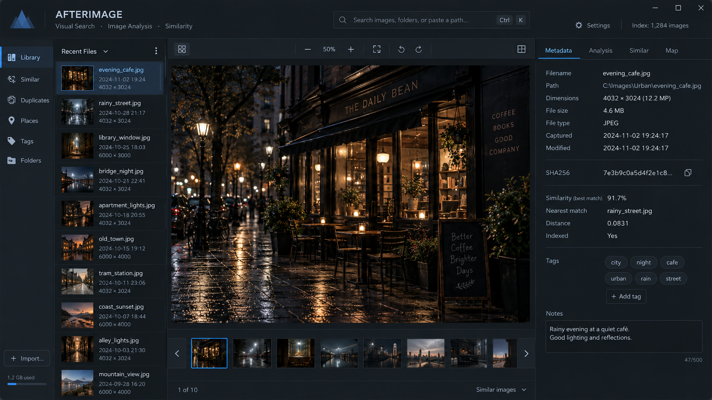

# afterimage

a small local visual index. scans a folder of images, computes
perceptual hashes (aHash/dHash), finds near-duplicates and similar
frames, and shows it all in a dark local dashboard.

## run

    pip install -r requirements.txt
    python3 tools/make_samples.py 1400     # optional synthetic corpus
    python3 web.py --root samples          # http://127.0.0.1:8777

## cli

    python3 afterimage.py scan --root samples
    python3 afterimage.py dupes --root samples --thresh 5
    python3 afterimage.py similar 12 --root samples
    python3 afterimage.py stats --root samples

index + thumbnails live under `<root>/.afterimage/`.
needs python >= 3.10 for `int.bit_count`.
